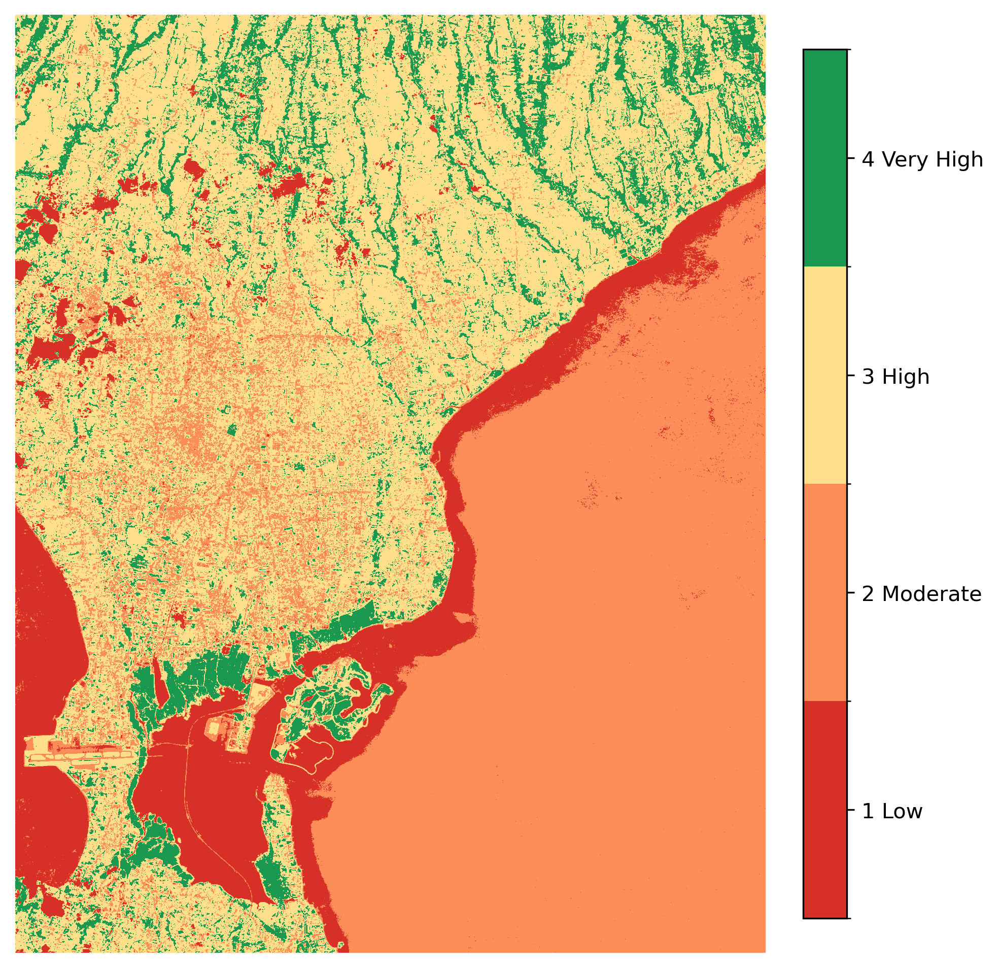

<div align="center">

# 🌿 **NDVI Vegetation Health Analysis — Denpasar, Bali**
### 🛰️ Remote Sensing • Geospatial • Python • AI Model Evaluation

<br>

[]()
[]()
[]()
[]()
[]()
[]()
[]()

<br>
</div>

---

<p align="center">
  
</p>

---

## 🌍 **Overview**

This project performs a complete **NDVI vegetation analysis** for **Denpasar, Bali**, using **Sentinel-2 L2A Surface Reflectance**.  
It demonstrates an EO workflow suitable for:

- Geospatial Data Analyst  
- Remote Sensing Specialist  
- AI/ML Geospatial Evaluator (RLHF)  
- Earth Observation Automation  

📌 Includes:

- Reflectance scaling  
- Cloud masking (SCL)  
- NDVI raster creation  
- Adaptive percentile classification  
- High-quality cartographic outputs  
- Polygonized vegetation zones (GPKG)  
- NDVI statistics summary  

---

## 🗂 **Project Structure**

```txt
project02_ndvi_analysis/
│
├── notebooks/
│   └── project02_ndvi_full.ipynb
│
├── data/
│   ├── raw/          # Sentinel-2 TIFF input
│   └── processed/    # NDVI & classified GeoTIFFs
│
└── README.md
```

---

## 📊 **Data Sources**

| Dataset                      | Source               | Usage                          |
|------------------------------|----------------------|--------------------------------|
| 🌍 **Sentinel-2 L2A**        | Google Earth Engine  | NDVI inputs (B4, B8, SCL)      |
| ☁️ **Scene Classification**  | GEE                  | Cloud/Shadow masking           |
| 📦 **AOI (BBox)**            | Custom               | Denpasar region                |

---

## 🔁 **Workflow Diagram (Visual)**

<p align="center">

</p>

---

## 🌈 **NDVI Class Legend**

| Class | Meaning     | Color       |
|-------|-------------|-------------|
| **1** | 🟥 Low       | `#d73027`   |
| **2** | 🟧 Moderate  | `#fc8d59`   |
| **3** | 🟨 High      | `#fee08b`   |
| **4** | 🟩 Very High | `#1a9850`   |

---

## 🖼 **Output Previews**

### ✔ Classified NDVI Map  
<p align="center">
  
</p>

### ✔ NDVI Histogram  
Generated from valid NDVI pixel distribution.

### ✔ GPKG Vegetation Zones  
`outputs/shapefiles/ndvi_denpasar_classes.gpkg`

---

## 📦 **Generated Outputs**

### 🗃 Raster Outputs  
Located in: `data/processed/`
- `ndvi_denpasar.tif`
- `ndvi_classified.tif`

### 🗂 Vector Outputs  
Located in: `outputs/shapefiles/`
- `ndvi_denpasar_classes.gpkg`

### 🧾 NDVI Statistics  
- `outputs/maps/ndvi_stats.json`

Contains:  
- NDVI min / max / mean  
- Class pixel distribution  

---

## 📘 **Main Notebook**

📄 `project02_ndvi_full.ipynb`

Includes:

- Cloud masking  
- Reflectance scaling  
- NDVI computation  
- Classification (1–4)  
- PNG rendering with colorbar + legend  
- Polygonization  
- Geometry simplification  
- QA validation steps  

---

## 🧪 **QA/QC Checks**

| Check               | Status        |
|---------------------|---------------|
| CRS                 | ✔ EPSG:4326   |
| Reflectance         | ✔ Normalized  |
| NDVI range          | ✔ -1 to 1     |
| Cloud removal       | ✔ SCL-based   |
| Classification bins | ✔ p10,p50,p90 |
| Geometry validity   | ✔ Passed      |

---

## 🎯 **Skills Demonstrated**

- Earth Observation data processing  
- Sentinel-2 reflectance handling  
- NDVI & vegetation metrics  
- RasterIO, GeoPandas, NumPy  
- Spatial classification & filtering  
- Vectorization (GPKG)  
- Map design & styling  
- AI model evaluation (Geospatial RLHF)  
- Geospatial QA/QC workflows  

---

## 👤 **Author**

**Samueli Windovado Fau**  
🌐 GitHub: https://github.com/samuelifau  
💼 LinkedIn: https://www.linkedin.com/in/samueli-fau  

---

<div align="center">

### ⭐ If this project was useful, please star the repo!  
It supports my applications for Geospatial / GeoAI / RLHF roles.

</div>
